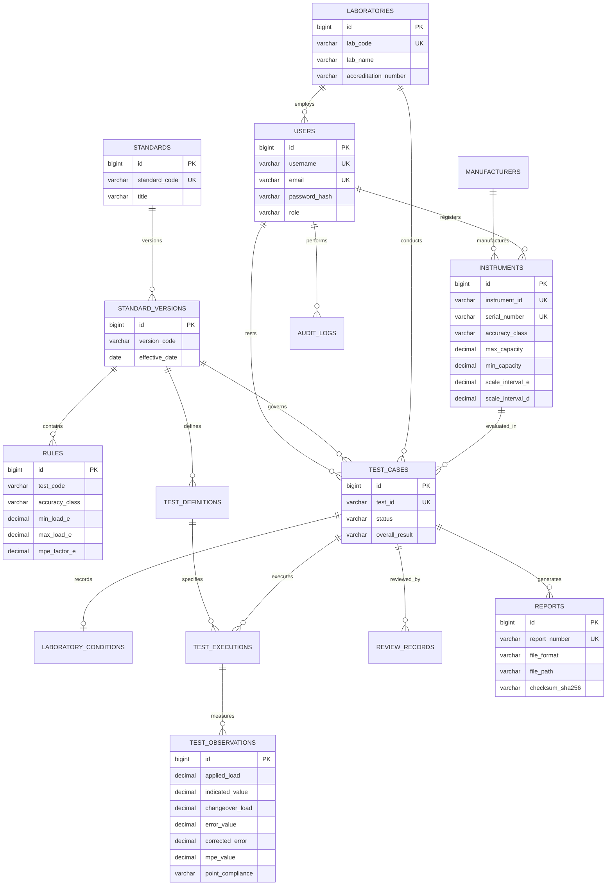

# LegalMetrix: Database Entity-Relationship Diagram

```mermaid
erDiagram
    LABORATORIES ||--o{ USERS : employs
    USERS ||--o{ INSTRUMENTS : registers
    MANUFACTURERS ||--o{ INSTRUMENTS : manufactures
    STANDARDS ||--o{ STANDARD_VERSIONS : versions
    STANDARD_VERSIONS ||--o{ RULES : contains
    STANDARD_VERSIONS ||--o{ TEST_DEFINITIONS : defines
    
    INSTRUMENTS ||--o{ TEST_CASES : evaluated_in
    LABORATORIES ||--o{ TEST_CASES : conducts
    STANDARD_VERSIONS ||--o{ TEST_CASES : governs
    USERS ||--o{ TEST_CASES : tests
    
    TEST_CASES ||--o| LABORATORY_CONDITIONS : records
    TEST_CASES ||--o{ TEST_EXECUTIONS : executes
    TEST_DEFINITIONS ||--o{ TEST_EXECUTIONS : specifies
    TEST_EXECUTIONS ||--o{ TEST_OBSERVATIONS : measures
    TEST_CASES ||--o{ REVIEW_RECORDS : reviewed_by
    TEST_CASES ||--o{ REPORTS : generates
    USERS ||--o{ AUDIT_LOGS : performs

    LABORATORIES {
        bigint id PK
        varchar lab_code UK
        varchar lab_name
        varchar accreditation_number
    }

    USERS {
        bigint id PK
        varchar username UK
        varchar email UK
        varchar password_hash
        varchar role
    }

    INSTRUMENTS {
        bigint id PK
        varchar instrument_id UK
        varchar serial_number UK
        varchar accuracy_class
        decimal max_capacity
        decimal min_capacity
        decimal scale_interval_e
        decimal scale_interval_d
    }

    STANDARDS {
        bigint id PK
        varchar standard_code UK
        varchar title
    }

    STANDARD_VERSIONS {
        bigint id PK
        varchar version_code
        date effective_date
    }

    RULES {
        bigint id PK
        varchar test_code
        varchar accuracy_class
        decimal min_load_e
        decimal max_load_e
        decimal mpe_factor_e
    }

    TEST_CASES {
        bigint id PK
        varchar test_id UK
        varchar status
        varchar overall_result
    }

    TEST_OBSERVATIONS {
        bigint id PK
        decimal applied_load
        decimal indicated_value
        decimal changeover_load
        decimal error_value
        decimal corrected_error
        decimal mpe_value
        varchar point_compliance
    }

    REPORTS {
        bigint id PK
        varchar report_number UK
        varchar file_format
        varchar file_path
        varchar checksum_sha256
    }
```
